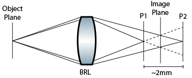
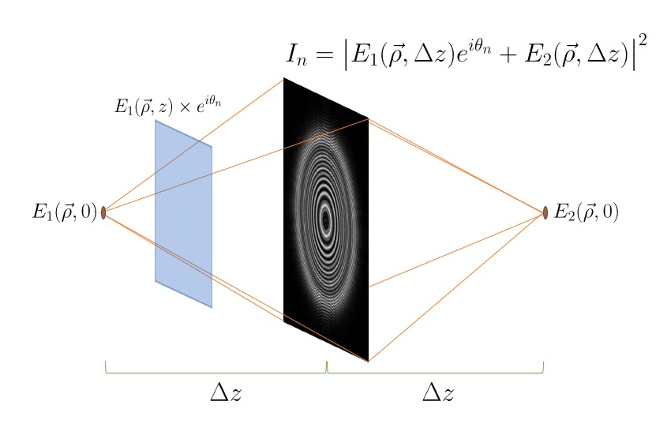

# FINCH
## Introduction
This is a MATLAB repository designed to simulate Fresnel Incoherent Correlation Holography (FINCH). The starting point for most of the code is a system with a bi-refringent lens.\
\
Because of the self-interference structure of FINCH, the two planes P1 and P2 are assumed to be conjugate image planes, which can then be fresnel propagated to the imaging plane in the center. We therefore want to simulate the following system:\
\
Here, the two fields are the same, and they propagate the same distance forward/backward to the imaging plane, where we then take the absolute value squared to get the intensity. One of the two fields is given a relative phase shift, however. This phase shift is important to be able to recover a single field from a series of interference patterns.
## Code Structure
Relevant scripts for plotting simulation are in the top directory `./`. Most helper functions are in the subfolder `./MATLAB_functions`. Some scripts for processing actual data are in `./Data_Scripts/`. Scripts designed to test basic functionality of the Fresnel propagator, Fourier transform, etc., are in `./Test_Scripts`.\
The span of this code is the Generation of fresnel holograms from simulated or real images, fresnel propagation of the holograms, and figure/movie generation to view in focus images. \
We additionally study the addition of shot noise to the input images, to analyze the effect on the resulting hologram. To aid in this we calculate several metrics for quantifying the performance of the FINCH system. These studies can be found in `Focal_Distance_Study.m`.
## Bench Setup
The actual setup uses a triangle interferometer, which produces the same effect as the simulated bi-refringent lens.\
\
This is the 'Version 2' interferometer which more closely follows the lens specifications of Brooker. The LED illuminated object (USAF target) passes through an objective relay (20x/4x objective followed by 200mm tube lens). The incoherent beam is then focused through the first lens in a 4F relay (200mm). The beam is then polarized 45 degrees relative to the PBS. In the PBS, the 2nd lens of the 4F relay (300mm) is slightly offset (10mm) such that the two arms of the interferometer travel different path lengths before hitting the second lens. Outside the interferometer, the QWP is angled 45 degrees relative to the PBS to convert the two interferometer arms into circularly polarized light. Finally, the recombined beam passes through a polarizer that we can freely rotate to get different relative phase shifts between the two beams.
## Bench Images
Many initial images are of a pinhole back-illuminated by 490nm incoherent (LED) light. Pinhole sizes of 500um, 75um, 20um, and 5um have been used for studies. These pinhole studies were done with 5x magnification, and no objective lens 4F relay.\
Images from the bench setup can be found in `./Images`. 
## References
Introduction to Fourier Optics - Joseph Goodman\
Computational Fourier Optics: A MATLAB Tutorial - David Voelz\
Nisan Siegel and Gary Brooker, "Single shot holographic super-resolution microscopy," Opt. Express 29, 15953-15968 (2021)\
